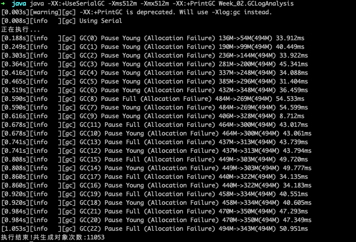
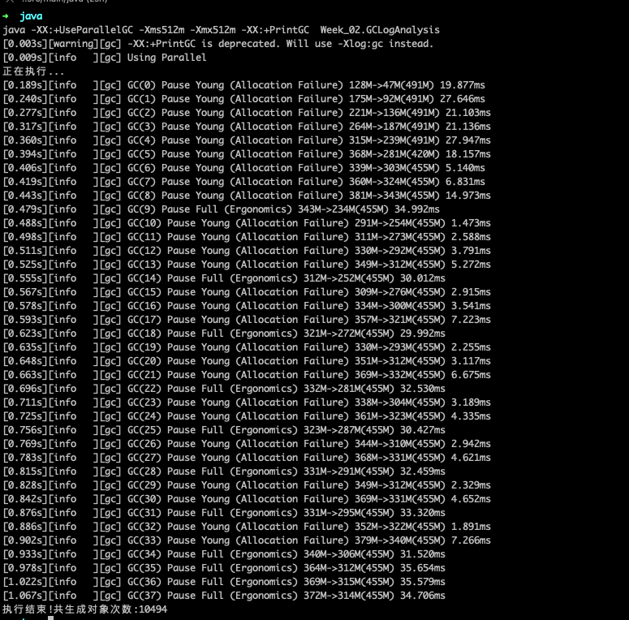

[TOC]

# Q1

###  串行 GC(SerialGC)

```java -XX:+UseSerialGC -Xms512m -Xmx512m -XX:+PrintGC Week_02.GCLogAnalysis```





* 单线程垃圾收集器，垃圾收集时触发 STW。业务线程也会停止，无法发挥多核处理器优势。


### 并行 GC(UseParallelGC)

`````
java -XX:+UseParallelGC -Xms512m -Xmx512m -XX:+PrintGC  Week_02.GCLogAnalysis
`````




- 与 串行 GC 没有明显变化

- 在 GC 期间，所有 CPU 核都在执行 GC，停顿时间短
- GC 线程只会出现在GC 工作时，降低了系统资源使用


### CMS(UseConcMarkSweepGC)

```java -XX:+UseConcMarkSweepGC -Xms512m -Xmx512m -XX:+PrintGC  Week_02.GCLogAnalysis```


```shell
[0.003s][warning][gc] -XX:+PrintGC is deprecated. Will use -Xlog:gc instead.
[0.009s][info   ][gc] Using Concurrent Mark Sweep
正在执行...
[0.208s][info   ][gc] GC(0) Pause Young (Allocation Failure) 136M->52M(494M) 27.980ms
[0.258s][info   ][gc] GC(1) Pause Young (Allocation Failure) 188M->101M(494M) 24.235ms
[0.304s][info   ][gc] GC(2) Pause Young (Allocation Failure) 237M->145M(494M) 30.166ms
[0.353s][info   ][gc] GC(3) Pause Young (Allocation Failure) 282M->189M(494M) 32.461ms
[0.353s][info   ][gc] GC(4) Pause Initial Mark 190M->190M(494M) 0.283ms
[0.353s][info   ][gc] GC(4) Concurrent Mark
[0.355s][info   ][gc] GC(4) Concurrent Mark 1.911ms
[0.355s][info   ][gc] GC(4) Concurrent Preclean
[0.356s][info   ][gc] GC(4) Concurrent Preclean 0.499ms
[0.356s][info   ][gc] GC(4) Concurrent Abortable Preclean
[0.401s][info   ][gc] GC(5) Pause Young (Allocation Failure) 326M->236M(494M) 31.076ms
[0.450s][info   ][gc] GC(6) Pause Young (Allocation Failure) 372M->281M(494M) 34.200ms
[0.499s][info   ][gc] GC(7) Pause Young (Allocation Failure) 418M->332M(494M) 34.209ms
[0.516s][info   ][gc] GC(4) Concurrent Abortable Preclean 160.413ms
[0.567s][info   ][gc] GC(9) Pause Full (Allocation Failure) 468M->228M(494M) 51.157ms
[0.567s][info   ][gc] GC(8) Pause Young (Allocation Failure) 468M->228M(494M) 51.240ms
[0.591s][info   ][gc] GC(10) Pause Young (Allocation Failure) 364M->284M(494M) 7.848ms
[0.591s][info   ][gc] GC(11) Pause Initial Mark 284M->284M(494M) 0.069ms
[0.591s][info   ][gc] GC(11) Concurrent Mark
[0.593s][info   ][gc] GC(11) Concurrent Mark 1.227ms
[0.593s][info   ][gc] GC(11) Concurrent Preclean
[0.593s][info   ][gc] GC(11) Concurrent Preclean 0.341ms
[0.593s][info   ][gc] GC(11) Concurrent Abortable Preclean
[0.615s][info   ][gc] GC(12) Pause Young (Allocation Failure) 420M->332M(494M) 9.183ms
[0.616s][info   ][gc] GC(11) Concurrent Abortable Preclean 23.066ms
[0.617s][info   ][gc] GC(11) Pause Remark 343M->343M(494M) 0.545ms
[0.617s][info   ][gc] GC(11) Concurrent Sweep
[0.617s][info   ][gc] GC(11) Concurrent Sweep 0.526ms
[0.617s][info   ][gc] GC(11) Concurrent Reset
[0.617s][info   ][gc] GC(11) Concurrent Reset 0.161ms
[0.668s][info   ][gc] GC(14) Pause Full (Allocation Failure) 437M->281M(494M) 39.206ms
[0.669s][info   ][gc] GC(13) Pause Young (Allocation Failure) 437M->281M(494M) 39.292ms
[0.669s][info   ][gc] GC(15) Pause Initial Mark 281M->281M(494M) 0.064ms
[0.669s][info   ][gc] GC(15) Concurrent Mark
[0.670s][info   ][gc] GC(15) Concurrent Mark 1.231ms
[0.670s][info   ][gc] GC(15) Concurrent Preclean
[0.670s][info   ][gc] GC(15) Concurrent Preclean 0.458ms
[0.671s][info   ][gc] GC(15) Concurrent Abortable Preclean
[0.695s][info   ][gc] GC(16) Pause Young (Allocation Failure) 417M->330M(494M) 6.800ms
[0.712s][info   ][gc] GC(15) Concurrent Abortable Preclean 41.967ms
[0.758s][info   ][gc] GC(18) Pause Full (Allocation Failure) 466M->300M(494M) 45.983ms
[0.758s][info   ][gc] GC(17) Pause Young (Allocation Failure) 466M->300M(494M) 46.060ms
[0.792s][info   ][gc] GC(19) Pause Young (Allocation Failure) 436M->346M(494M) 13.121ms
[0.792s][info   ][gc] GC(20) Pause Initial Mark 350M->350M(494M) 0.056ms
[0.792s][info   ][gc] GC(20) Concurrent Mark
[0.793s][info   ][gc] GC(20) Concurrent Mark 1.269ms
[0.793s][info   ][gc] GC(20) Concurrent Preclean
[0.794s][info   ][gc] GC(20) Concurrent Preclean 0.407ms
[0.794s][info   ][gc] GC(20) Concurrent Abortable Preclean
[0.794s][info   ][gc] GC(20) Concurrent Abortable Preclean 0.009ms
[0.795s][info   ][gc] GC(20) Pause Remark 359M->359M(494M) 1.169ms
[0.795s][info   ][gc] GC(20) Concurrent Sweep
[0.795s][info   ][gc] GC(20) Concurrent Sweep 0.516ms
[0.796s][info   ][gc] GC(20) Concurrent Reset
[0.796s][info   ][gc] GC(20) Concurrent Reset 0.146ms
[0.818s][info   ][gc] GC(21) Pause Young (Allocation Failure) 436M->348M(494M) 10.291ms
[0.819s][info   ][gc] GC(22) Pause Initial Mark 351M->351M(494M) 0.094ms
[0.819s][info   ][gc] GC(22) Concurrent Mark
[0.820s][info   ][gc] GC(22) Concurrent Mark 1.465ms
[0.820s][info   ][gc] GC(22) Concurrent Preclean
[0.821s][info   ][gc] GC(22) Concurrent Preclean 0.433ms
[0.821s][info   ][gc] GC(22) Concurrent Abortable Preclean
[0.821s][info   ][gc] GC(22) Concurrent Abortable Preclean 0.008ms
[0.821s][info   ][gc] GC(22) Pause Remark 364M->364M(494M) 0.602ms
[0.822s][info   ][gc] GC(22) Concurrent Sweep
[0.822s][info   ][gc] GC(22) Concurrent Sweep 0.720ms
[0.822s][info   ][gc] GC(22) Concurrent Reset
[0.822s][info   ][gc] GC(22) Concurrent Reset 0.166ms
[0.881s][info   ][gc] GC(24) Pause Full (Allocation Failure) 440M->307M(494M) 46.413ms
[0.881s][info   ][gc] GC(23) Pause Young (Allocation Failure) 440M->307M(494M) 46.483ms
[0.881s][info   ][gc] GC(25) Pause Initial Mark 310M->310M(494M) 0.074ms
[0.881s][info   ][gc] GC(25) Concurrent Mark
[0.882s][info   ][gc] GC(25) Concurrent Mark 1.410ms
[0.882s][info   ][gc] GC(25) Concurrent Preclean
[0.883s][info   ][gc] GC(25) Concurrent Preclean 0.480ms
[0.883s][info   ][gc] GC(25) Concurrent Abortable Preclean
[0.898s][info   ][gc] GC(25) Concurrent Abortable Preclean 14.757ms
[0.944s][info   ][gc] GC(27) Pause Full (Allocation Failure) 443M->316M(494M) 46.444ms
[0.944s][info   ][gc] GC(26) Pause Young (Allocation Failure) 443M->316M(494M) 46.529ms
[1.010s][info   ][gc] GC(29) Pause Full (Allocation Failure) 453M->319M(494M) 45.189ms
[1.010s][info   ][gc] GC(28) Pause Young (Allocation Failure) 453M->319M(494M) 45.278ms
[1.010s][info   ][gc] GC(30) Pause Initial Mark 322M->322M(494M) 0.093ms
[1.011s][info   ][gc] GC(30) Concurrent Mark
[1.012s][info   ][gc] GC(30) Concurrent Mark 1.744ms
[1.012s][info   ][gc] GC(30) Concurrent Preclean
[1.013s][info   ][gc] GC(30) Concurrent Preclean 0.599ms
[1.013s][info   ][gc] GC(30) Concurrent Abortable Preclean
[1.013s][info   ][gc] GC(30) Concurrent Abortable Preclean 0.012ms
[1.014s][info   ][gc] GC(30) Pause Remark 342M->342M(494M) 0.775ms
[1.014s][info   ][gc] GC(30) Concurrent Sweep
[1.014s][info   ][gc] GC(30) Concurrent Sweep 0.521ms
[1.014s][info   ][gc] GC(30) Concurrent Reset
[1.015s][info   ][gc] GC(30) Concurrent Reset 0.239ms
[1.073s][info   ][gc] GC(32) Pause Full (Allocation Failure) 456M->316M(494M) 43.724ms
[1.073s][info   ][gc] GC(31) Pause Young (Allocation Failure) 456M->316M(494M) 43.804ms
[1.073s][info   ][gc] GC(33) Pause Initial Mark 320M->320M(494M) 0.075ms
[1.073s][info   ][gc] GC(33) Concurrent Mark
[1.074s][info   ][gc] GC(33) Concurrent Mark 1.261ms
[1.074s][info   ][gc] GC(33) Concurrent Preclean
[1.075s][info   ][gc] GC(33) Concurrent Preclean 0.439ms
[1.075s][info   ][gc] GC(33) Concurrent Abortable Preclean
执行结束!共生成对象次数:12384
[1.104s][info   ][gc] GC(33) Concurrent Abortable Preclean 28.928ms
[1.105s][info   ][gc] GC(33) Pause Remark 339M->339M(494M) 1.344ms
[1.105s][info   ][gc] GC(33) Concurrent Sweep
[1.106s][info   ][gc] GC(33) Concurrent Sweep 0.428ms
[1.106s][info   ][gc] GC(33) Concurrent Reset
[1.106s][info   ][gc] GC(33) Concurrent Reset 0.190ms

```


- 停顿时间短

###  G1(UseG1GC)

```shell
[0.003s][warning][gc] -XX:+PrintGC is deprecated. Will use -Xlog:gc instead.
[0.011s][info   ][gc] Using G1
正在执行...
[0.104s][info   ][gc] GC(0) Pause Young (Normal) (G1 Evacuation Pause) 37M->18M(512M) 5.643ms
[0.114s][info   ][gc] GC(1) Pause Young (Normal) (G1 Evacuation Pause) 50M->30M(512M) 2.869ms
[0.154s][info   ][gc] GC(2) Pause Young (Normal) (G1 Evacuation Pause) 129M->66M(512M) 9.173ms
[0.159s][info   ][gc] GC(3) Pause Young (Normal) (G1 Evacuation Pause) 92M->75M(512M) 2.179ms
[0.164s][info   ][gc] GC(4) Pause Young (Normal) (G1 Evacuation Pause) 103M->85M(512M) 2.727ms
[0.174s][info   ][gc] GC(5) Pause Young (Normal) (G1 Evacuation Pause) 122M->97M(512M) 3.127ms
[0.183s][info   ][gc] GC(6) Pause Young (Normal) (G1 Evacuation Pause) 138M->114M(512M) 3.306ms
[0.191s][info   ][gc] GC(7) Pause Young (Normal) (G1 Evacuation Pause) 149M->126M(512M) 3.857ms
[0.197s][info   ][gc] GC(8) Pause Young (Normal) (G1 Evacuation Pause) 158M->137M(512M) 3.117ms
[0.205s][info   ][gc] GC(9) Pause Young (Normal) (G1 Evacuation Pause) 166M->147M(512M) 3.740ms
[0.212s][info   ][gc] GC(10) Pause Young (Normal) (G1 Evacuation Pause) 176M->155M(512M) 4.568ms
[0.221s][info   ][gc] GC(11) Pause Young (Normal) (G1 Evacuation Pause) 190M->169M(512M) 3.033ms
[0.231s][info   ][gc] GC(12) Pause Young (Normal) (G1 Evacuation Pause) 205M->184M(512M) 5.803ms
[0.245s][info   ][gc] GC(13) Pause Young (Normal) (G1 Evacuation Pause) 227M->203M(512M) 5.610ms
[0.269s][info   ][gc] GC(14) Pause Young (Normal) (G1 Evacuation Pause) 269M->223M(512M) 11.127ms
[0.276s][info   ][gc] GC(15) Pause Young (Concurrent Start) (G1 Humongous Allocation) 266M->240M(512M) 2.997ms
[0.276s][info   ][gc] GC(16) Concurrent Cycle
[0.279s][info   ][gc] GC(16) Pause Remark 258M->257M(512M) 0.879ms
[0.281s][info   ][gc] GC(16) Pause Cleanup 263M->263M(512M) 0.117ms
[0.288s][info   ][gc] GC(16) Concurrent Cycle 11.221ms
[0.325s][info   ][gc] GC(17) Pause Young (Prepare Mixed) (G1 Evacuation Pause) 313M->263M(512M) 19.523ms
[0.334s][info   ][gc] GC(18) Pause Young (Mixed) (G1 Evacuation Pause) 295M->252M(512M) 5.436ms
[0.335s][info   ][gc] GC(19) Pause Young (Concurrent Start) (G1 Humongous Allocation) 256M->253M(512M) 0.994ms
[0.335s][info   ][gc] GC(20) Concurrent Cycle
[0.337s][info   ][gc] GC(20) Pause Remark 264M->264M(512M) 0.978ms
[0.338s][info   ][gc] GC(20) Pause Cleanup 269M->269M(512M) 0.072ms
[0.341s][info   ][gc] GC(20) Concurrent Cycle 5.509ms
[0.374s][info   ][gc] GC(21) Pause Young (Prepare Mixed) (G1 Evacuation Pause) 376M->294M(512M) 14.844ms
[0.384s][info   ][gc] GC(22) Pause Young (Mixed) (G1 Evacuation Pause) 313M->287M(512M) 7.649ms
[0.385s][info   ][gc] GC(23) Pause Young (Concurrent Start) (G1 Humongous Allocation) 288M->286M(512M) 0.911ms
[0.385s][info   ][gc] GC(24) Concurrent Cycle
[0.387s][info   ][gc] GC(24) Pause Remark 297M->297M(512M) 0.951ms
[0.388s][info   ][gc] GC(24) Pause Cleanup 302M->302M(512M) 0.108ms
[0.389s][info   ][gc] GC(24) Concurrent Cycle 3.844ms
[0.418s][info   ][gc] GC(25) Pause Young (Prepare Mixed) (G1 Evacuation Pause) 384M->320M(512M) 21.825ms
[0.434s][info   ][gc] GC(26) Pause Young (Mixed) (G1 Evacuation Pause) 345M->312M(512M) 13.012ms
[0.479s][info   ][gc] GC(27) Pause Young (Concurrent Start) (G1 Humongous Allocation) 398M->346M(512M) 36.344ms
[0.479s][info   ][gc] GC(28) Concurrent Cycle
[0.482s][info   ][gc] GC(28) Pause Remark 363M->363M(512M) 1.313ms
[0.483s][info   ][gc] GC(28) Pause Cleanup 369M->369M(512M) 0.080ms
[0.484s][info   ][gc] GC(28) Concurrent Cycle 4.578ms
[0.529s][info   ][gc] GC(29) Pause Young (Prepare Mixed) (G1 Evacuation Pause) 421M->364M(512M) 35.317ms
[0.536s][info   ][gc] GC(30) Pause Young (Mixed) (G1 Evacuation Pause) 391M->358M(512M) 2.891ms
[0.544s][info   ][gc] GC(31) Pause Young (Mixed) (G1 Evacuation Pause) 387M->357M(512M) 2.989ms
[0.551s][info   ][gc] GC(32) Pause Young (Mixed) (G1 Evacuation Pause) 392M->360M(512M) 3.699ms
[0.553s][info   ][gc] GC(33) Pause Young (Concurrent Start) (G1 Humongous Allocation) 365M->362M(512M) 1.282ms
[0.553s][info   ][gc] GC(34) Concurrent Cycle
[0.556s][info   ][gc] GC(34) Pause Remark 370M->370M(512M) 1.016ms
[0.557s][info   ][gc] GC(34) Pause Cleanup 380M->380M(512M) 0.130ms
[0.558s][info   ][gc] GC(34) Concurrent Cycle 4.477ms
[0.561s][info   ][gc] GC(35) Pause Young (Prepare Mixed) (G1 Evacuation Pause) 398M->375M(512M) 1.618ms
[0.570s][info   ][gc] GC(36) Pause Young (Mixed) (G1 Evacuation Pause) 408M->372M(512M) 4.434ms
[0.575s][info   ][gc] GC(37) Pause Young (Mixed) (G1 Evacuation Pause) 399M->369M(512M) 2.402ms
[0.581s][info   ][gc] GC(38) Pause Young (Mixed) (G1 Evacuation Pause) 404M->371M(512M) 3.034ms
[0.583s][info   ][gc] GC(39) Pause Young (Concurrent Start) (G1 Humongous Allocation) 373M->372M(512M) 1.061ms
[0.583s][info   ][gc] GC(40) Concurrent Cycle
[0.585s][info   ][gc] GC(40) Pause Remark 384M->384M(512M) 1.008ms
[0.586s][info   ][gc] GC(40) Pause Cleanup 394M->394M(512M) 0.073ms
[0.587s][info   ][gc] GC(40) Concurrent Cycle 4.087ms
[0.590s][info   ][gc] GC(41) Pause Young (Prepare Mixed) (G1 Evacuation Pause) 408M->383M(512M) 1.324ms
[0.595s][info   ][gc] GC(42) Pause Young (Mixed) (G1 Evacuation Pause) 415M->374M(512M) 2.267ms
[0.602s][info   ][gc] GC(43) Pause Young (Mixed) (G1 Evacuation Pause) 407M->370M(512M) 2.562ms
[0.608s][info   ][gc] GC(44) Pause Young (Mixed) (G1 Evacuation Pause) 406M->372M(512M) 1.905ms
[0.609s][info   ][gc] GC(45) Pause Young (Concurrent Start) (G1 Humongous Allocation) 375M->373M(512M) 1.242ms
[0.609s][info   ][gc] GC(46) Concurrent Cycle
[0.612s][info   ][gc] GC(46) Pause Remark 382M->382M(512M) 1.291ms
[0.613s][info   ][gc] GC(46) Pause Cleanup 391M->391M(512M) 0.161ms
[0.614s][info   ][gc] GC(46) Concurrent Cycle 4.997ms
[0.618s][info   ][gc] GC(47) Pause Young (Prepare Mixed) (G1 Evacuation Pause) 420M->385M(512M) 1.279ms
[0.632s][info   ][gc] GC(48) Pause Young (Mixed) (G1 Evacuation Pause) 422M->373M(512M) 10.787ms
[0.633s][info   ][gc] GC(49) Pause Young (Concurrent Start) (G1 Humongous Allocation) 374M->373M(512M) 0.786ms
[0.633s][info   ][gc] GC(50) Concurrent Cycle
[0.636s][info   ][gc] GC(50) Pause Remark 386M->386M(512M) 1.034ms
[0.637s][info   ][gc] GC(50) Pause Cleanup 402M->402M(512M) 0.089ms
[0.638s][info   ][gc] GC(50) Concurrent Cycle 4.695ms
[0.641s][info   ][gc] GC(51) Pause Young (Prepare Mixed) (G1 Evacuation Pause) 421M->386M(512M) 1.395ms
[0.649s][info   ][gc] GC(52) Pause Young (Mixed) (G1 Evacuation Pause) 417M->384M(512M) 4.340ms
[0.650s][info   ][gc] GC(53) Pause Young (Concurrent Start) (G1 Humongous Allocation) 385M->384M(512M) 1.085ms
[0.650s][info   ][gc] GC(54) Concurrent Cycle
[0.653s][info   ][gc] GC(54) Pause Remark 397M->397M(512M) 1.144ms
[0.654s][info   ][gc] GC(54) Pause Cleanup 404M->404M(512M) 0.084ms
[0.655s][info   ][gc] GC(54) Concurrent Cycle 4.785ms
[0.658s][info   ][gc] GC(55) Pause Young (Prepare Mixed) (G1 Evacuation Pause) 429M->401M(512M) 1.551ms
[0.665s][info   ][gc] GC(56) Pause Young (Mixed) (G1 Evacuation Pause) 433M->394M(512M) 4.054ms
[0.666s][info   ][gc] GC(57) Pause Young (Concurrent Start) (G1 Humongous Allocation) 395M->394M(512M) 0.976ms
[0.666s][info   ][gc] GC(58) Concurrent Cycle
[0.669s][info   ][gc] GC(58) Pause Remark 402M->402M(512M) 1.028ms
[0.670s][info   ][gc] GC(58) Pause Cleanup 410M->410M(512M) 0.098ms
[0.671s][info   ][gc] GC(58) Concurrent Cycle 4.204ms
[0.673s][info   ][gc] GC(59) Pause Young (Prepare Mixed) (G1 Evacuation Pause) 438M->409M(512M) 1.199ms
[0.680s][info   ][gc] GC(60) Pause Young (Mixed) (G1 Evacuation Pause) 440M->402M(512M) 3.684ms
[0.681s][info   ][gc] GC(61) Pause Young (Concurrent Start) (G1 Humongous Allocation) 403M->402M(512M) 1.248ms
[0.681s][info   ][gc] GC(62) Concurrent Cycle
[0.683s][info   ][gc] GC(62) Pause Remark 409M->409M(512M) 0.384ms
[0.684s][info   ][gc] GC(62) Pause Cleanup 420M->420M(512M) 0.102ms
[0.684s][info   ][gc] GC(62) Concurrent Cycle 3.109ms
[0.687s][info   ][gc] GC(63) Pause Young (Prepare Mixed) (G1 Evacuation Pause) 438M->414M(512M) 0.661ms
[0.693s][info   ][gc] GC(64) Pause Young (Mixed) (G1 Evacuation Pause) 453M->409M(512M) 2.878ms
[0.695s][info   ][gc] GC(65) Pause Young (Concurrent Start) (G1 Humongous Allocation) 413M->411M(512M) 1.381ms
[0.695s][info   ][gc] GC(66) Concurrent Cycle
[0.698s][info   ][gc] GC(66) Pause Remark 421M->421M(512M) 1.170ms
[0.699s][info   ][gc] GC(66) Pause Cleanup 429M->429M(512M) 0.114ms
[0.700s][info   ][gc] GC(66) Concurrent Cycle 4.120ms
[0.702s][info   ][gc] GC(67) Pause Young (Prepare Mixed) (G1 Evacuation Pause) 445M->419M(512M) 0.842ms
[0.708s][info   ][gc] GC(68) Pause Young (Mixed) (G1 Evacuation Pause) 455M->413M(512M) 2.801ms
[0.709s][info   ][gc] GC(69) Pause Young (Concurrent Start) (G1 Humongous Allocation) 414M->413M(512M) 0.753ms
[0.709s][info   ][gc] GC(70) Concurrent Cycle
[0.711s][info   ][gc] GC(70) Pause Remark 423M->423M(512M) 0.504ms
[0.712s][info   ][gc] GC(70) Pause Cleanup 433M->433M(512M) 0.116ms
[0.713s][info   ][gc] GC(70) Concurrent Cycle 3.529ms
[0.715s][info   ][gc] GC(71) Pause Young (Prepare Mixed) (G1 Evacuation Pause) 449M->425M(512M) 0.762ms
[0.722s][info   ][gc] GC(72) Pause Young (Mixed) (G1 Evacuation Pause) 456M->425M(512M) 3.214ms
[0.724s][info   ][gc] GC(73) Pause Young (Concurrent Start) (G1 Humongous Allocation) 426M->426M(512M) 1.355ms
[0.724s][info   ][gc] GC(74) Concurrent Cycle
[0.726s][info   ][gc] GC(74) Pause Remark 434M->434M(512M) 1.172ms
[0.727s][info   ][gc] GC(74) Pause Cleanup 439M->439M(512M) 0.104ms
[0.728s][info   ][gc] GC(74) Concurrent Cycle 4.334ms
[0.732s][info   ][gc] GC(75) Pause Young (Prepare Mixed) (G1 Evacuation Pause) 464M->438M(512M) 1.292ms
[0.739s][info   ][gc] GC(76) Pause Young (Mixed) (G1 Evacuation Pause) 472M->427M(512M) 2.592ms
[0.740s][info   ][gc] GC(77) Pause Young (Concurrent Start) (G1 Humongous Allocation) 428M->427M(512M) 0.719ms
[0.740s][info   ][gc] GC(78) Concurrent Cycle
[0.741s][info   ][gc] GC(78) Pause Remark 438M->438M(512M) 0.461ms
[0.743s][info   ][gc] GC(78) Pause Cleanup 448M->448M(512M) 0.165ms
[0.743s][info   ][gc] GC(78) Concurrent Cycle 3.428ms
[0.746s][info   ][gc] GC(79) Pause Young (Prepare Mixed) (G1 Evacuation Pause) 469M->436M(512M) 0.736ms
[0.754s][info   ][gc] GC(80) To-space exhausted
[0.754s][info   ][gc] GC(80) Pause Young (Mixed) (G1 Evacuation Pause) 480M->466M(512M) 3.386ms
[0.756s][info   ][gc] GC(81) Pause Young (Concurrent Start) (G1 Humongous Allocation) 467M->466M(512M) 1.248ms
[0.756s][info   ][gc] GC(82) Concurrent Cycle
[0.758s][info   ][gc] GC(82) Pause Remark 478M->478M(512M) 1.115ms
[0.759s][info   ][gc] GC(82) Pause Cleanup 491M->491M(512M) 0.111ms
[0.760s][info   ][gc] GC(82) Concurrent Cycle 4.175ms
[0.763s][info   ][gc] GC(83) To-space exhausted
[0.763s][info   ][gc] GC(83) Pause Young (Prepare Mixed) (G1 Evacuation Pause) 504M->495M(512M) 1.204ms
[0.767s][info   ][gc] GC(84) To-space exhausted
[0.767s][info   ][gc] GC(84) Pause Young (Mixed) (G1 Humongous Allocation) 511M->504M(512M) 1.416ms
[0.768s][info   ][gc] GC(85) To-space exhausted
[0.768s][info   ][gc] GC(85) Pause Young (Mixed) (G1 Humongous Allocation) 510M->507M(512M) 1.121ms
[0.769s][info   ][gc] GC(86) Pause Young (Concurrent Start) (G1 Humongous Allocation) 508M->508M(512M) 0.842ms
[0.770s][info   ][gc] GC(87) Concurrent Cycle
[0.771s][info   ][gc] GC(88) To-space exhausted
[0.771s][info   ][gc] GC(88) Pause Young (Normal) (G1 Humongous Allocation) 511M->509M(512M) 0.962ms
[0.772s][info   ][gc] GC(89) To-space exhausted
[0.772s][info   ][gc] GC(89) Pause Young (Normal) (G1 Evacuation Pause) 511M->511M(512M) 0.867ms
[0.792s][info   ][gc] GC(90) Pause Full (G1 Evacuation Pause) 511M->390M(512M) 19.703ms
[0.793s][info   ][gc] GC(87) Concurrent Cycle 23.290ms
[0.795s][info   ][gc] GC(91) Pause Young (Concurrent Start) (G1 Humongous Allocation) 394M->392M(512M) 1.186ms
[0.795s][info   ][gc] GC(92) Concurrent Cycle
[0.798s][info   ][gc] GC(92) Pause Remark 400M->396M(512M) 1.466ms
[0.799s][info   ][gc] GC(92) Pause Cleanup 400M->400M(512M) 0.148ms
[0.800s][info   ][gc] GC(92) Concurrent Cycle 5.191ms
[0.802s][info   ][gc] GC(93) Pause Young (Concurrent Start) (G1 Humongous Allocation) 406M->394M(512M) 1.968ms
[0.802s][info   ][gc] GC(94) Concurrent Cycle
[0.804s][info   ][gc] GC(94) Pause Remark 402M->402M(512M) 0.817ms
[0.806s][info   ][gc] GC(94) Pause Cleanup 409M->409M(512M) 0.109ms
[0.806s][info   ][gc] GC(94) Concurrent Cycle 4.052ms
[0.810s][info   ][gc] GC(95) Pause Young (Prepare Mixed) (G1 Evacuation Pause) 426M->398M(512M) 1.562ms
[0.816s][info   ][gc] GC(96) Pause Young (Mixed) (G1 Evacuation Pause) 437M->413M(512M) 1.032ms
[0.817s][info   ][gc] GC(97) Pause Young (Concurrent Start) (G1 Humongous Allocation) 413M->412M(512M) 1.274ms
[0.817s][info   ][gc] GC(98) Concurrent Cycle
[0.819s][info   ][gc] GC(98) Pause Remark 423M->423M(512M) 0.572ms
[0.821s][info   ][gc] GC(98) Pause Cleanup 430M->430M(512M) 0.183ms
[0.821s][info   ][gc] GC(98) Concurrent Cycle 4.249ms
[0.825s][info   ][gc] GC(99) Pause Young (Prepare Mixed) (G1 Evacuation Pause) 449M->422M(512M) 1.525ms
[0.833s][info   ][gc] GC(100) To-space exhausted
[0.833s][info   ][gc] GC(100) Pause Young (Mixed) (G1 Evacuation Pause) 454M->442M(512M) 3.123ms
[0.836s][info   ][gc] GC(101) Pause Young (Concurrent Start) (G1 Humongous Allocation) 446M->443M(512M) 1.530ms
[0.836s][info   ][gc] GC(102) Concurrent Cycle
[0.837s][info   ][gc] GC(102) Pause Remark 455M->455M(512M) 0.460ms
[0.839s][info   ][gc] GC(102) Pause Cleanup 469M->469M(512M) 0.129ms
[0.839s][info   ][gc] GC(102) Concurrent Cycle 3.656ms
[0.842s][info   ][gc] GC(103) To-space exhausted
[0.842s][info   ][gc] GC(103) Pause Young (Prepare Mixed) (G1 Humongous Allocation) 485M->473M(512M) 1.139ms
[0.844s][info   ][gc] GC(104) To-space exhausted
[0.844s][info   ][gc] GC(104) Pause Young (Mixed) (G1 Evacuation Pause) 486M->481M(512M) 1.165ms
[0.845s][info   ][gc] GC(105) To-space exhausted
[0.845s][info   ][gc] GC(105) Pause Young (Mixed) (G1 Humongous Allocation) 485M->484M(512M) 0.669ms
[0.846s][info   ][gc] GC(106) Pause Young (Concurrent Start) (G1 Humongous Allocation) 485M->485M(512M) 0.940ms
[0.846s][info   ][gc] GC(107) Concurrent Cycle
[0.847s][info   ][gc] GC(108) Pause Young (Normal) (G1 Evacuation Pause) 486M->485M(512M) 0.259ms
[0.847s][info   ][gc] GC(109) To-space exhausted
[0.847s][info   ][gc] GC(109) Pause Young (Normal) (G1 Humongous Allocation) 485M->485M(512M) 0.306ms
[0.868s][info   ][gc] GC(110) Pause Full (G1 Humongous Allocation) 485M->405M(512M) 20.094ms
[0.868s][info   ][gc] GC(107) Concurrent Cycle 21.318ms
[0.869s][info   ][gc] GC(111) Pause Young (Concurrent Start) (G1 Humongous Allocation) 412M->407M(512M) 0.467ms
[0.869s][info   ][gc] GC(112) Concurrent Cycle
[0.871s][info   ][gc] GC(112) Pause Remark 417M->416M(512M) 0.487ms
[0.872s][info   ][gc] GC(112) Pause Cleanup 423M->423M(512M) 0.141ms
[0.873s][info   ][gc] GC(112) Concurrent Cycle 3.808ms
[0.874s][info   ][gc] GC(113) Pause Young (Concurrent Start) (G1 Humongous Allocation) 427M->407M(512M) 1.352ms
[0.874s][info   ][gc] GC(114) Concurrent Cycle
[0.876s][info   ][gc] GC(114) Pause Remark 417M->417M(512M) 0.558ms
[0.877s][info   ][gc] GC(114) Pause Cleanup 423M->423M(512M) 0.113ms
[0.878s][info   ][gc] GC(114) Concurrent Cycle 3.520ms
[0.880s][info   ][gc] GC(115) Pause Young (Prepare Mixed) (G1 Evacuation Pause) 439M->416M(512M) 0.950ms
[0.885s][info   ][gc] GC(116) Pause Young (Mixed) (G1 Evacuation Pause) 452M->427M(512M) 0.922ms
[0.887s][info   ][gc] GC(117) Pause Young (Concurrent Start) (G1 Humongous Allocation) 432M->429M(512M) 0.720ms
[0.887s][info   ][gc] GC(118) Concurrent Cycle
[0.889s][info   ][gc] GC(118) Pause Remark 438M->438M(512M) 0.586ms
[0.890s][info   ][gc] GC(118) Pause Cleanup 452M->452M(512M) 0.113ms
[0.890s][info   ][gc] GC(118) Concurrent Cycle 3.483ms
[0.894s][info   ][gc] GC(119) Pause Young (Prepare Mixed) (G1 Evacuation Pause) 470M->440M(512M) 1.642ms
[0.900s][info   ][gc] GC(120) To-space exhausted
[0.900s][info   ][gc] GC(120) Pause Young (Mixed) (G1 Evacuation Pause) 475M->469M(512M) 1.845ms
[0.902s][info   ][gc] GC(121) Pause Young (Concurrent Start) (G1 Humongous Allocation) 470M->469M(512M) 1.147ms
[0.902s][info   ][gc] GC(122) Concurrent Cycle
[0.903s][info   ][gc] GC(122) Pause Remark 477M->477M(512M) 0.471ms
[0.905s][info   ][gc] GC(123) To-space exhausted
[0.905s][info   ][gc] GC(123) Pause Young (Normal) (G1 Evacuation Pause) 482M->478M(512M) 0.536ms
[0.906s][info   ][gc] GC(122) Pause Cleanup 480M->480M(512M) 0.142ms
[0.907s][info   ][gc] GC(124) To-space exhausted
[0.907s][info   ][gc] GC(124) Pause Young (Prepare Mixed) (G1 Humongous Allocation) 482M->479M(512M) 0.979ms
[0.907s][info   ][gc] GC(122) Concurrent Cycle 5.474ms
[0.909s][info   ][gc] GC(125) To-space exhausted
[0.909s][info   ][gc] GC(125) Pause Young (Mixed) (G1 Humongous Allocation) 481M->480M(512M) 1.435ms
[0.910s][info   ][gc] GC(126) To-space exhausted
[0.910s][info   ][gc] GC(126) Pause Young (Mixed) (G1 Humongous Allocation) 482M->481M(512M) 0.937ms
[0.910s][info   ][gc] GC(127) To-space exhausted
[0.910s][info   ][gc] GC(127) Pause Young (Mixed) (G1 Evacuation Pause) 482M->482M(512M) 0.436ms
[0.929s][info   ][gc] GC(128) Pause Full (G1 Evacuation Pause) 482M->406M(512M) 18.894ms
[0.931s][info   ][gc] GC(129) Pause Young (Concurrent Start) (G1 Humongous Allocation) 406M->406M(512M) 1.493ms
[0.931s][info   ][gc] GC(130) Concurrent Cycle
[0.933s][info   ][gc] GC(130) Pause Remark 413M->413M(512M) 0.537ms
[0.934s][info   ][gc] GC(130) Pause Cleanup 422M->422M(512M) 0.150ms
[0.935s][info   ][gc] GC(130) Concurrent Cycle 3.913ms
[0.936s][info   ][gc] GC(131) Pause Young (Concurrent Start) (G1 Humongous Allocation) 426M->410M(512M) 0.584ms
[0.936s][info   ][gc] GC(132) Concurrent Cycle
[0.938s][info   ][gc] GC(132) Pause Remark 419M->419M(512M) 0.453ms
[0.939s][info   ][gc] GC(132) Pause Cleanup 428M->428M(512M) 0.148ms
[0.939s][info   ][gc] GC(132) Concurrent Cycle 3.515ms
[0.941s][info   ][gc] GC(133) Pause Young (Concurrent Start) (G1 Humongous Allocation) 432M->414M(512M) 1.560ms
[0.942s][info   ][gc] GC(134) Concurrent Cycle
[0.944s][info   ][gc] GC(134) Pause Remark 424M->423M(512M) 0.998ms
[0.945s][info   ][gc] GC(134) Pause Cleanup 432M->432M(512M) 0.133ms
[0.945s][info   ][gc] GC(134) Concurrent Cycle 3.937ms
[0.949s][info   ][gc] GC(135) Pause Young (Prepare Mixed) (G1 Evacuation Pause) 448M->423M(512M) 1.450ms
[0.954s][info   ][gc] GC(136) Pause Young (Mixed) (G1 Evacuation Pause) 459M->433M(512M) 1.031ms
[0.956s][info   ][gc] GC(137) Pause Young (Concurrent Start) (G1 Humongous Allocation) 435M->432M(512M) 1.283ms
[0.956s][info   ][gc] GC(138) Concurrent Cycle
[0.958s][info   ][gc] GC(138) Pause Remark 443M->443M(512M) 0.814ms
[0.959s][info   ][gc] GC(138) Pause Cleanup 452M->452M(512M) 0.142ms
[0.960s][info   ][gc] GC(138) Concurrent Cycle 3.764ms
[0.963s][info   ][gc] GC(139) Pause Young (Prepare Mixed) (G1 Evacuation Pause) 468M->444M(512M) 1.414ms
[0.967s][info   ][gc] GC(140) To-space exhausted
[0.967s][info   ][gc] GC(140) Pause Young (Mixed) (G1 Evacuation Pause) 476M->470M(512M) 1.070ms
[0.969s][info   ][gc] GC(141) Pause Young (Concurrent Start) (G1 Humongous Allocation) 471M->469M(512M) 1.386ms
[0.969s][info   ][gc] GC(142) Concurrent Cycle
[0.971s][info   ][gc] GC(142) Pause Remark 483M->483M(512M) 1.033ms
[0.972s][info   ][gc] GC(143) To-space exhausted
[0.972s][info   ][gc] GC(143) Pause Young (Normal) (G1 Evacuation Pause) 484M->477M(512M) 0.618ms
[0.973s][info   ][gc] GC(142) Pause Cleanup 481M->481M(512M) 0.162ms
[0.974s][info   ][gc] GC(142) Concurrent Cycle 4.953ms
[0.974s][info   ][gc] GC(144) To-space exhausted
[0.974s][info   ][gc] GC(144) Pause Young (Prepare Mixed) (G1 Evacuation Pause) 484M->480M(512M) 0.407ms
[0.975s][info   ][gc] GC(145) To-space exhausted
[0.975s][info   ][gc] GC(145) Pause Young (Mixed) (G1 Evacuation Pause) 484M->483M(512M) 0.488ms
[0.976s][info   ][gc] GC(146) To-space exhausted
[0.976s][info   ][gc] GC(146) Pause Young (Mixed) (G1 Humongous Allocation) 483M->483M(512M) 0.486ms
[0.996s][info   ][gc] GC(147) Pause Full (G1 Humongous Allocation) 483M->408M(512M) 20.218ms
[0.998s][info   ][gc] GC(148) Pause Young (Concurrent Start) (G1 Humongous Allocation) 414M->410M(512M) 0.520ms
[0.998s][info   ][gc] GC(149) Concurrent Cycle
[1.000s][info   ][gc] GC(149) Pause Remark 419M->418M(512M) 0.560ms
[1.002s][info   ][gc] GC(149) Pause Cleanup 426M->426M(512M) 0.150ms
[1.002s][info   ][gc] GC(149) Concurrent Cycle 4.059ms
[1.003s][info   ][gc] GC(150) Pause Young (Concurrent Start) (G1 Humongous Allocation) 428M->416M(512M) 0.692ms
[1.003s][info   ][gc] GC(151) Concurrent Cycle
[1.005s][info   ][gc] GC(151) Pause Remark 426M->426M(512M) 0.525ms
[1.006s][info   ][gc] GC(151) Pause Cleanup 432M->432M(512M) 0.120ms
[1.007s][info   ][gc] GC(151) Concurrent Cycle 3.557ms
[1.010s][info   ][gc] GC(152) Pause Young (Prepare Mixed) (G1 Evacuation Pause) 453M->424M(512M) 0.956ms
[1.015s][info   ][gc] GC(153) Pause Young (Mixed) (G1 Evacuation Pause) 453M->433M(512M) 0.930ms
[1.017s][info   ][gc] GC(154) Pause Young (Concurrent Start) (G1 Humongous Allocation) 435M->432M(512M) 1.392ms
[1.017s][info   ][gc] GC(155) Concurrent Cycle
[1.018s][info   ][gc] GC(155) Pause Remark 439M->439M(512M) 0.386ms
[1.020s][info   ][gc] GC(155) Pause Cleanup 449M->449M(512M) 0.147ms
[1.020s][info   ][gc] GC(155) Concurrent Cycle 3.385ms
[1.023s][info   ][gc] GC(156) Pause Young (Prepare Mixed) (G1 Evacuation Pause) 462M->439M(512M) 0.807ms
[1.029s][info   ][gc] GC(157) To-space exhausted
[1.029s][info   ][gc] GC(157) Pause Young (Mixed) (G1 Evacuation Pause) 467M->463M(512M) 1.537ms
[1.030s][info   ][gc] GC(158) Pause Young (Concurrent Start) (G1 Humongous Allocation) 464M->463M(512M) 0.702ms
[1.030s][info   ][gc] GC(159) Concurrent Cycle
[1.032s][info   ][gc] GC(159) Pause Remark 476M->476M(512M) 1.208ms
[1.034s][info   ][gc] GC(160) To-space exhausted
[1.034s][info   ][gc] GC(160) Pause Young (Normal) (G1 Evacuation Pause) 483M->475M(512M) 0.615ms
[1.034s][info   ][gc] GC(159) Pause Cleanup 477M->477M(512M) 0.132ms
[1.035s][info   ][gc] GC(159) Concurrent Cycle 4.993ms
[1.036s][info   ][gc] GC(161) To-space exhausted
[1.036s][info   ][gc] GC(161) Pause Young (Prepare Mixed) (G1 Humongous Allocation) 484M->481M(512M) 0.397ms
[1.036s][info   ][gc] GC(162) To-space exhausted
[1.037s][info   ][gc] GC(162) Pause Young (Mixed) (G1 Evacuation Pause) 484M->484M(512M) 0.437ms
[1.057s][info   ][gc] GC(163) Pause Full (G1 Evacuation Pause) 484M->407M(512M) 20.145ms
[1.058s][info   ][gc] GC(164) Pause Young (Concurrent Start) (G1 Humongous Allocation) 408M->407M(512M) 0.422ms
[1.058s][info   ][gc] GC(165) Concurrent Cycle
[1.060s][info   ][gc] GC(165) Pause Remark 418M->418M(512M) 0.527ms
[1.061s][info   ][gc] GC(165) Pause Cleanup 427M->427M(512M) 0.139ms
[1.062s][info   ][gc] GC(165) Concurrent Cycle 4.213ms
[1.063s][info   ][gc] GC(166) Pause Young (Concurrent Start) (G1 Humongous Allocation) 431M->411M(512M) 0.700ms
[1.063s][info   ][gc] GC(167) Concurrent Cycle
[1.066s][info   ][gc] GC(167) Pause Remark 420M->420M(512M) 1.340ms
[1.067s][info   ][gc] GC(167) Pause Cleanup 427M->427M(512M) 0.147ms
[1.068s][info   ][gc] GC(167) Concurrent Cycle 4.479ms
[1.069s][info   ][gc] GC(168) Pause Young (Concurrent Start) (G1 Humongous Allocation) 431M->414M(512M) 0.778ms
[1.069s][info   ][gc] GC(169) Concurrent Cycle
[1.071s][info   ][gc] GC(169) Pause Remark 420M->420M(512M) 0.541ms
[1.072s][info   ][gc] GC(169) Pause Cleanup 423M->423M(512M) 0.124ms
[1.072s][info   ][gc] GC(169) Concurrent Cycle 3.667ms
执行结束!共生成对象次数:13061she

```


- young阶段的每次回收容量不规律
- 并发回收时速度快
- 混合模式下速度也快
- FullGC延时高


# 压测

```java -jar -Xms512m -Xmx512m gateway-server-0.0.1-SNAPSHOT.jar```

``````shell
 wrk -t8 -c40 -d60s http://localhost:8088/api/hello
``````

```shell
Running 1m test @ http://localhost:8088/api/hello
  8 threads and 40 connections
  Thread Stats   Avg      Stdev     Max   +/- Stdev
    Latency    16.93ms   64.23ms 587.67ms   93.30%
    Req/Sec     5.97k     1.55k   11.09k    80.39%
  2678667 requests in 1.00m, 319.81MB read
Requests/sec:  44593.06
Transfer/sec:      5.32MB

```


``````shell
java -jar -Xms2g -Xmx2g gateway-server-0.0.1-SNAPSHOT.jar
``````

```shell
Running 1m test @ http://localhost:8088/api/hello
  8 threads and 40 connections
  Thread Stats   Avg      Stdev     Max   +/- Stdev
    Latency    11.03ms   37.80ms 411.06ms   93.34%
    Req/Sec     4.36k     1.71k   11.88k    67.04%
  Latency Distribution
     50%    0.92ms
     75%    1.49ms
     90%   17.02ms
     99%  203.94ms
  2025288 requests in 1.00m, 241.80MB read
Requests/sec:  33703.41
Transfer/sec:      4.02MB
```


- 调整了堆设置后，GC 次数边少了，提高了 QPS。